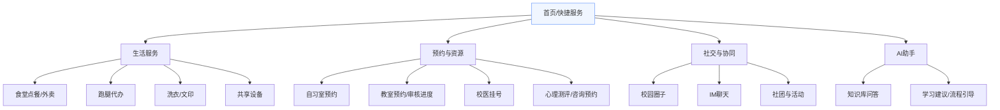
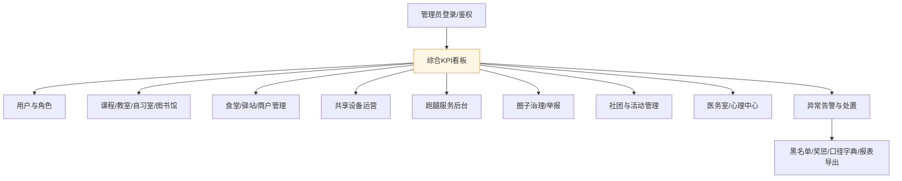
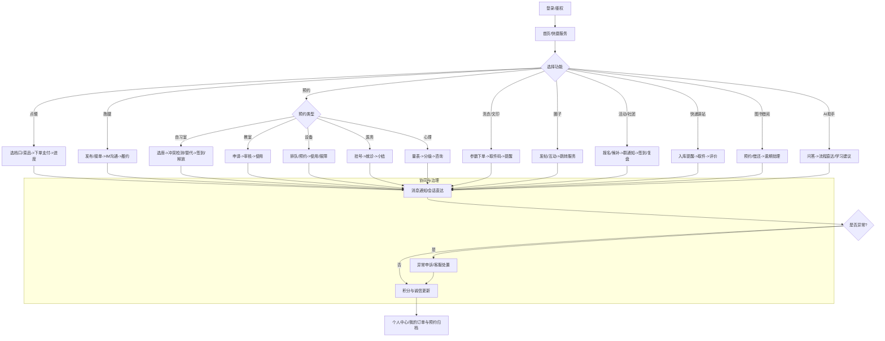
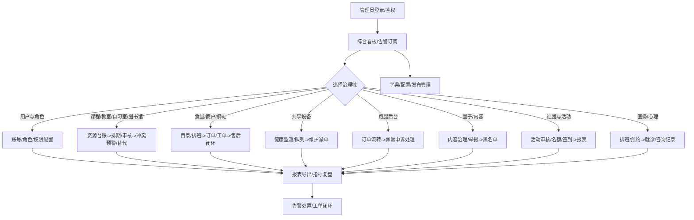

产品使用手册-智慧校园生活管理系统

版本：v1.0（面向试点院校）

一、适用对象与运行环境
- 学生：移动端办理点餐、跑腿、预约、活动、心理、校医等。
- 教师/教务：课程与教室排期、活动审核。
- 后勤/物业与商户：共享设备与食堂运营、报障与排队治理。
- 管理员：数据看板、用户与角色、告警与SLA、配置与字典。
- 运行环境：B/S 架构，现代浏览器；服务端容器化部署，MySQL + 对象存储；集成网易云信 IM UIKit、网易 CodeWave 与 CoreAgent。

二、产品功能架构
说明：分移动端与PC端两部分展示。

1) 移动端功能架构

2) PC端功能架构

三、开始使用
1. 登录与权限
- 使用校园账号登录；首次登录完成资料校验（头像/学号/联系方式）。
- 角色与权限自动下发；如需申请社团管理员/商户权限，联系管理员开通。

2. 主页与快捷服务
- 首页聚合常用入口（点餐、跑腿、预约、活动、AI助手等）。
- 顶部搜索可直达功能/帖子/活动；右上角显示消息与待办红点。

四、使用流程图
1) 移动端使用总流程（覆盖点餐/跑腿/预约/洗衣文印/共享设备/医务/心理/圈子/活动/驿站/图书/AI/异常与诚信）

2) PC端管理总流程（覆盖各治理域、审核/黑名单/报表/告警闭环）

五、典型学习示例（上手指南）
1. 考试周“自习室抢座与替代推荐”
- 进入“预约-自习室”，在楼层图选择目标座位与时间。
- 若冲突，系统给出相邻座位/近时段替代；一键改订。
- 到点未签到自动释放，累计爽约将影响诚信分。

2. “三单并行”的跑腿路径优化
- 发布A/B/C三单时段相近任务；骑手端自动收到合并建议。
- 系统基于距离/时窗/评分优化路径；发生拥堵时自动重规划。
- 订单完成后统一评价，异常单支持申诉与补偿。

3. 食堂高峰“错峰点餐 + 取餐提醒”
- 首页点餐查看热门档口与预测拥堵提示，优先下单不拥堵档口。
- 外带/外卖选择后开启进度提醒，取餐码用于到点自提。

4. AI 助手“数学作业辅导”
- 在AI助手输入题目或拍照文字，系统给出解题思路与相似题资源。
- 可请求“再讲详细一点/换一种方法”，收藏到“学习清单”。

5. 活动报名“资格校验 + 黑名单治理”
- 浏览活动详情，系统按积分/诚信与黑名单规则校验报名资格。
- 报名成功自动加入活动群；签到记分，迟到/爽约扣诚信。

