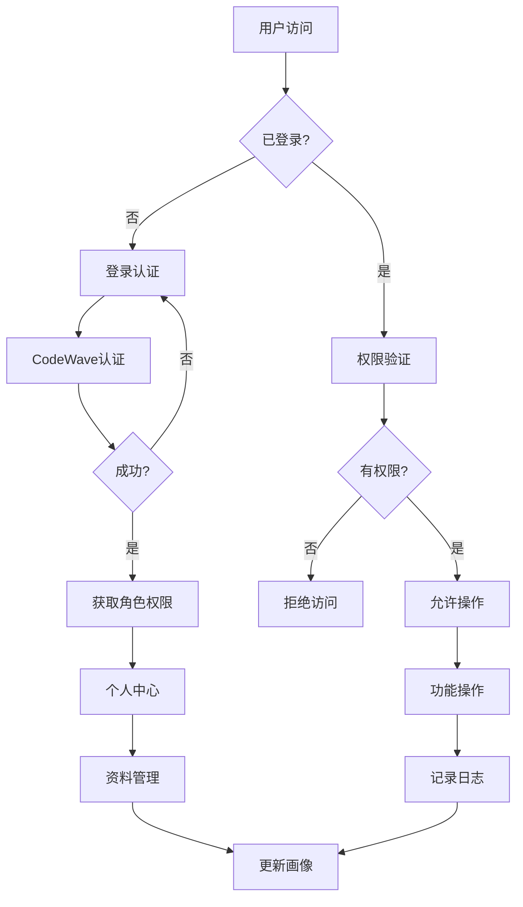
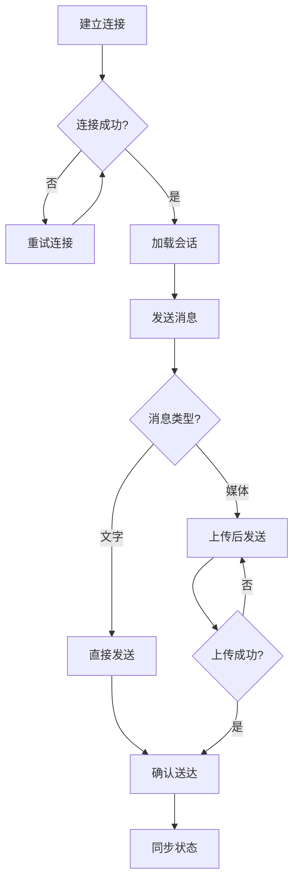
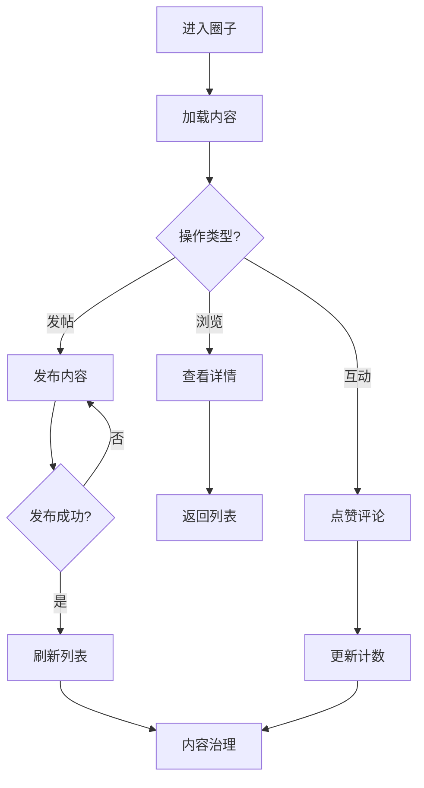
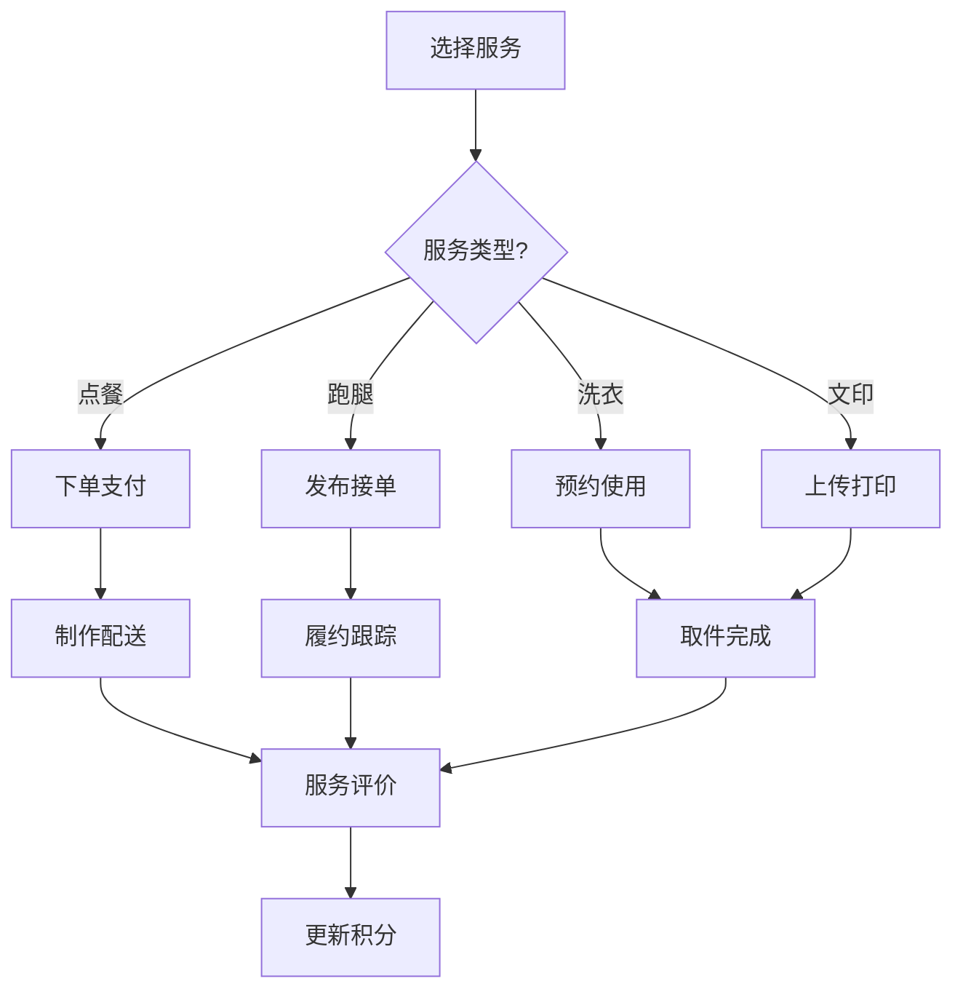
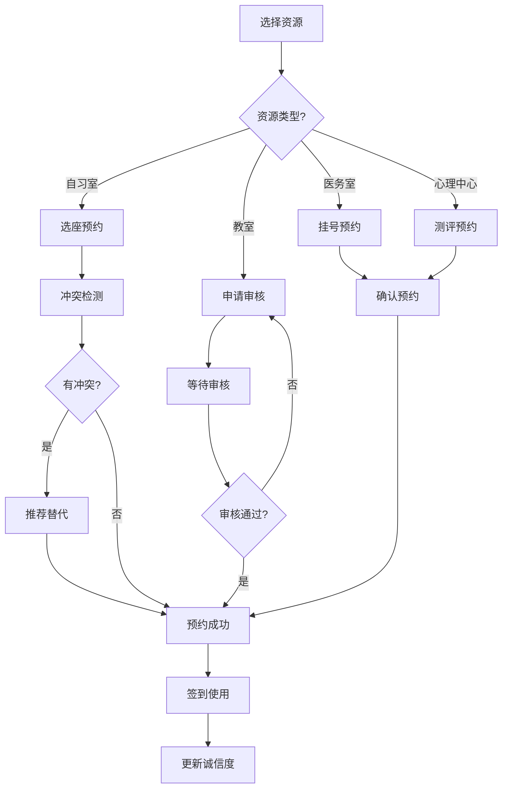
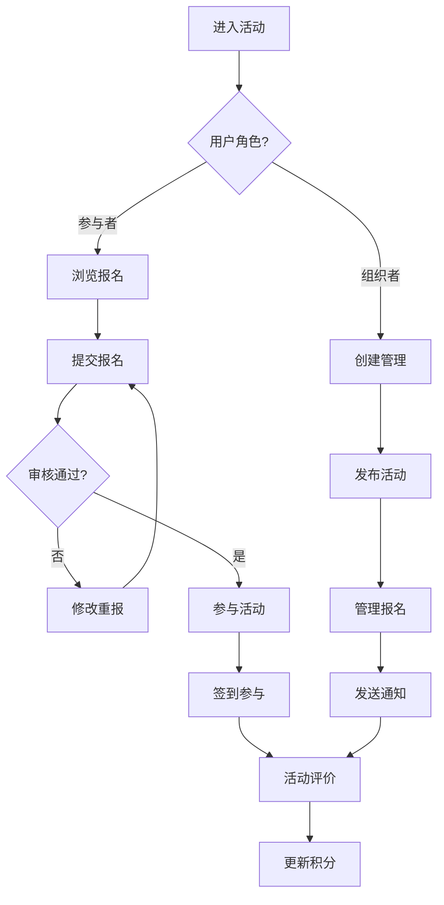
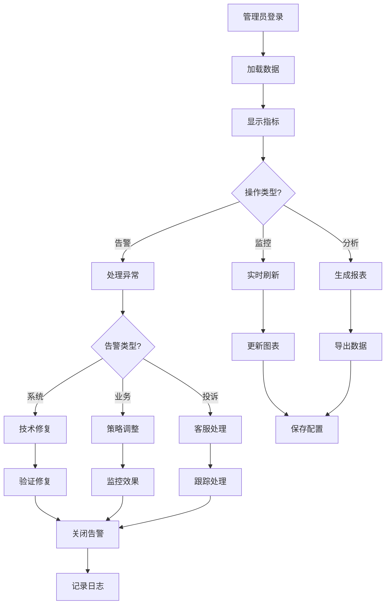
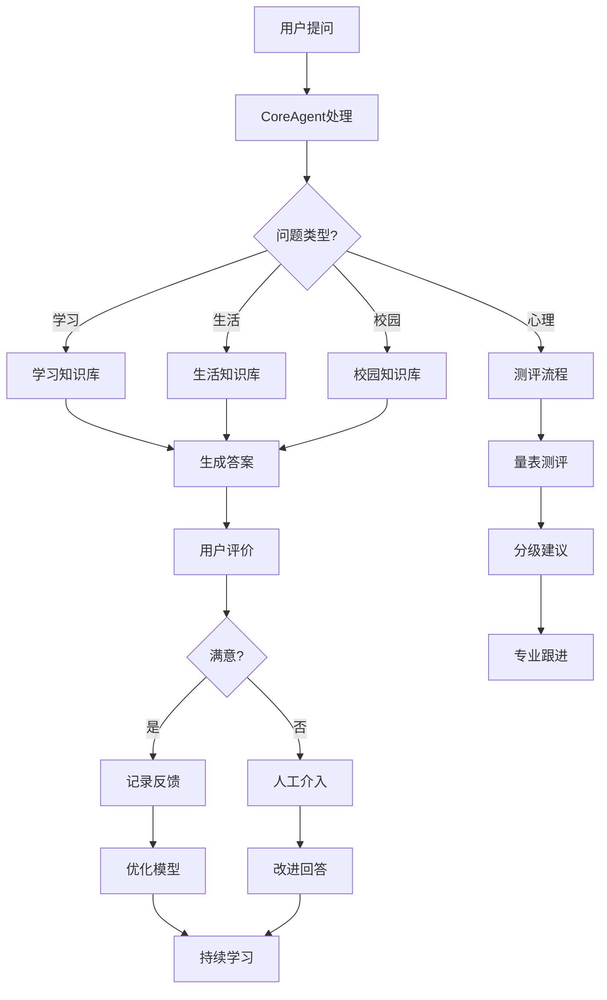

# 5.2 系统基础模块流程图

## 5.2.1 用户管理与权限模块

```mermaid
flowchart TD
    A[用户访问] --> B{已登录?}
    B -->|否| C[登录认证]
    B -->|是| D[权限验证]
    C --> E[CodeWave认证]
    E --> F{成功?}
    F -->|否| C
    F -->|是| G[获取角色权限]
    D --> H{有权限?}
    H -->|否| I[拒绝访问]
    H -->|是| J[允许操作]
    G --> K[个人中心]
    J --> L[功能操作]
    K --> M[资料管理]
    L --> N[记录日志]
    M --> O[更新画像]
    N --> O
```

## 5.2.2 消息通讯与协同模块

```mermaid
flowchart TD
    A[建立连接] --> B{连接成功?}
    B -->|否| C[重试连接]
    B -->|是| D[加载会话]
    C --> B
    D --> E[发送消息]
    E --> F{消息类型?}
    F -->|文字| G[直接发送]
    F -->|媒体| H[上传后发送]
    G --> I[确认送达]
    H --> J{上传成功?}
    J -->|否| H
    J -->|是| I
    I --> K[同步状态]
```

## 5.2.3 内容管理与社交模块

```mermaid
flowchart TD
    A[进入圈子] --> B[加载内容]
    B --> C{操作类型?}
    C -->|浏览| D[查看详情]
    C -->|发帖| E[发布内容]
    C -->|互动| F[点赞评论]
    D --> G[返回列表]
    E --> H{发布成功?}
    H -->|否| E
    H -->|是| I[刷新列表]
    F --> J[更新计数]
    I --> K[内容治理]
    J --> K
```

## 5.2.4 生活服务与交易模块

```mermaid
flowchart TD
    A[选择服务] --> B{服务类型?}
    B -->|点餐| C[下单支付]
    B -->|跑腿| D[发布接单]
    B -->|洗衣| E[预约使用]
    B -->|文印| F[上传打印]
    C --> G[制作配送]
    D --> H[履约跟踪]
    E --> I[取件完成]
    F --> I
    G --> J[服务评价]
    H --> J
    I --> J
    J --> K[更新积分]
```

## 5.2.5 预约管理与资源调度模块

```mermaid
flowchart TD
    A[选择资源] --> B{资源类型?}
    B -->|自习室| C[选座预约]
    B -->|教室| D[申请审核]
    B -->|医务室| E[挂号预约]
    B -->|心理中心| F[测评预约]
    C --> G[冲突检测]
    D --> H[等待审核]
    E --> I[确认预约]
    F --> I
    G --> J{有冲突?}
    J -->|是| K[推荐替代]
    J -->|否| L[预约成功]
    H --> M{审核通过?}
    M -->|否| D
    M -->|是| L
    K --> L
    I --> L
    L --> N[签到使用]
    N --> O[更新诚信度]
```

## 5.2.6 活动管理与社团运营模块

```mermaid
flowchart TD
    A[进入活动] --> B{用户角色?}
    B -->|参与者| C[浏览报名]
    B -->|组织者| D[创建管理]
    C --> E[提交报名]
    E --> F{审核通过?}
    F -->|否| G[修改重报]
    F -->|是| H[参与活动]
    D --> I[发布活动]
    I --> J[管理报名]
    G --> E
    H --> K[签到参与]
    J --> L[发送通知]
    K --> M[活动评价]
    L --> M
    M --> N[更新积分]
```

## 5.2.7 数据看板与治理模块

```mermaid
flowchart TD
    A[管理员登录] --> B[加载数据]
    B --> C[显示指标]
    C --> D{操作类型?}
    D -->|监控| E[实时刷新]
    D -->|分析| F[生成报表]
    D -->|告警| G[处理异常]
    E --> H[更新图表]
    F --> I[导出数据]
    G --> J{告警类型?}
    J -->|系统| K[技术修复]
    J -->|业务| L[策略调整]
    J -->|投诉| M[客服处理]
    H --> N[保存配置]
    I --> N
    K --> O[验证修复]
    L --> P[监控效果]
    M --> Q[跟踪处理]
    O --> R[关闭告警]
    P --> R
    Q --> R
    R --> S[记录日志]
```

## 5.2.8 AI助手与智能服务模块

```mermaid
flowchart TD
    A[用户提问] --> B[CoreAgent处理]
    B --> C{问题类型?}
    C -->|学习| D[学习知识库]
    C -->|生活| E[生活知识库]
    C -->|校园| F[校园知识库]
    C -->|心理| G[测评流程]
    D --> H[生成答案]
    E --> H
    F --> H
    G --> I[量表测评]
    H --> J[用户评价]
    I --> K[分级建议]
    J --> L{满意?}
    L -->|是| M[记录反馈]
    L -->|否| N[人工介入]
    K --> O[专业跟进]
    M --> P[优化模型]
    N --> Q[改进回答]
    P --> R[持续学习]
    Q --> R
```
