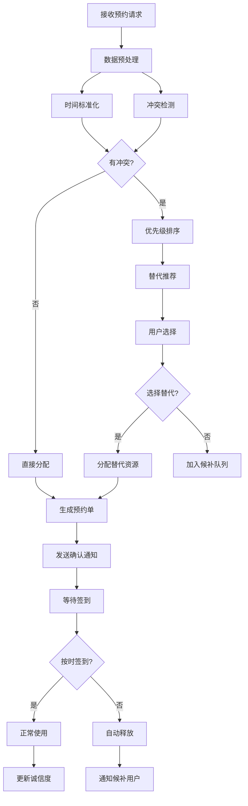
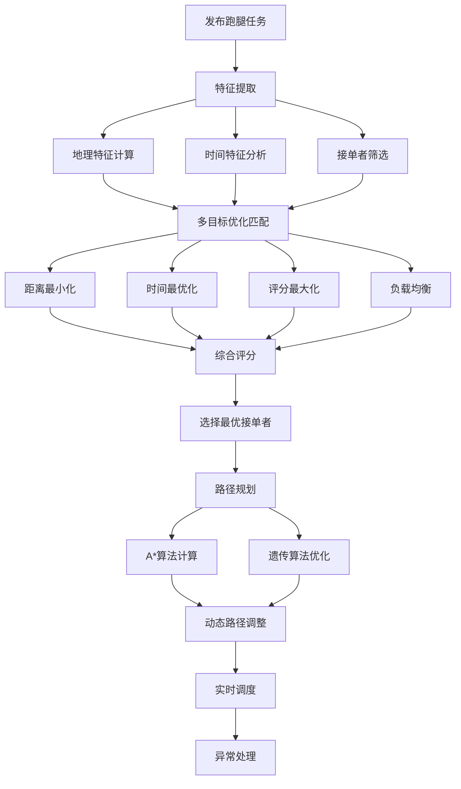
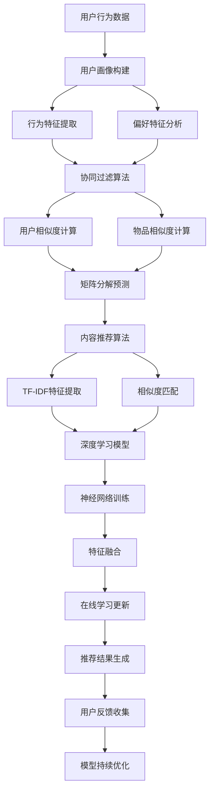
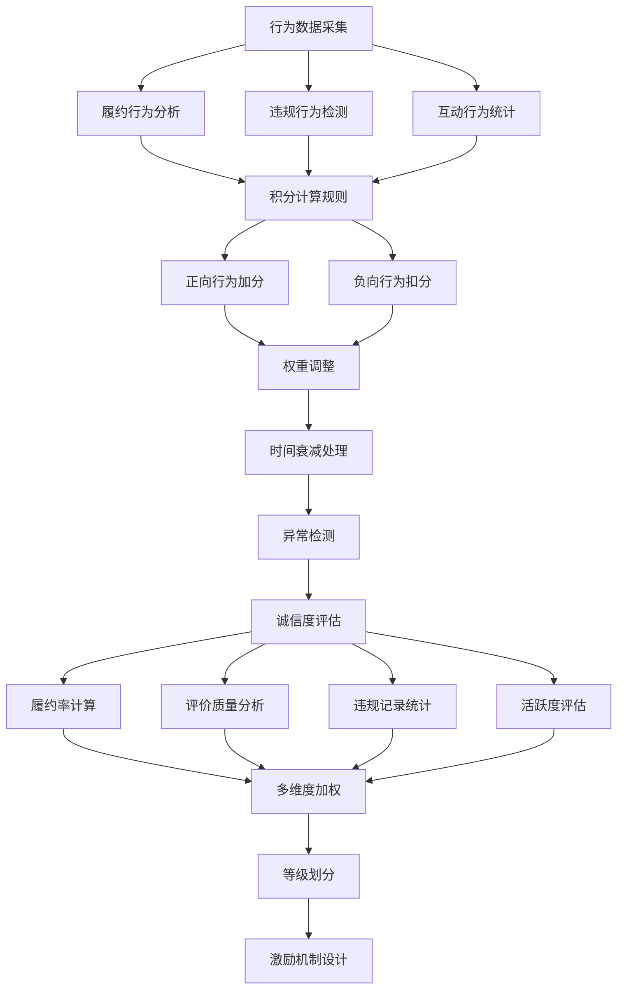
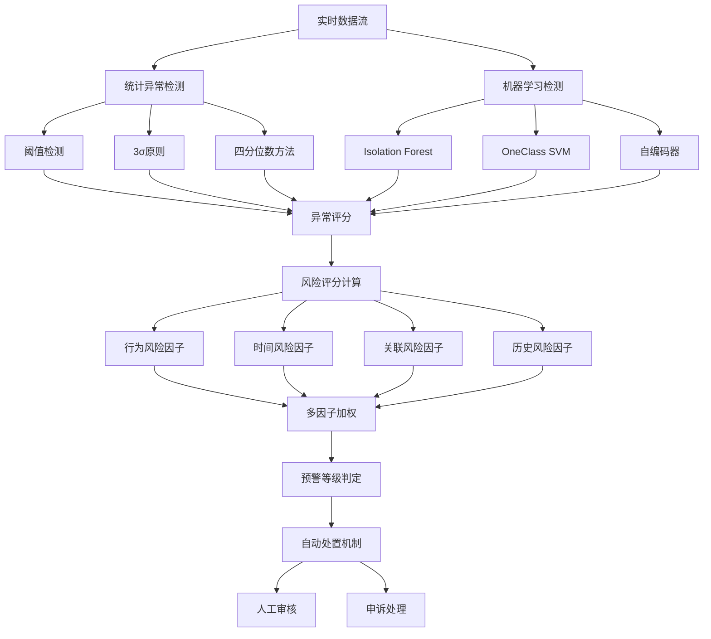
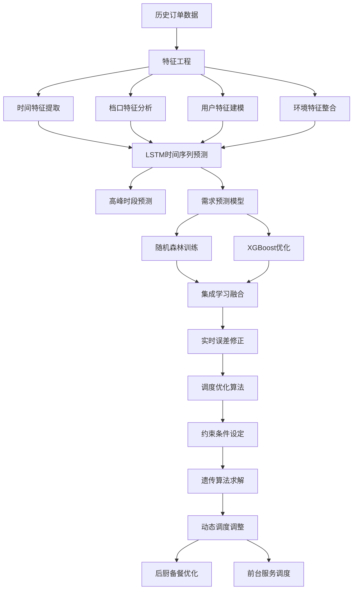
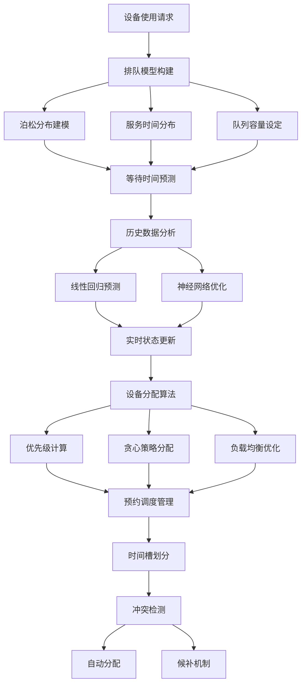
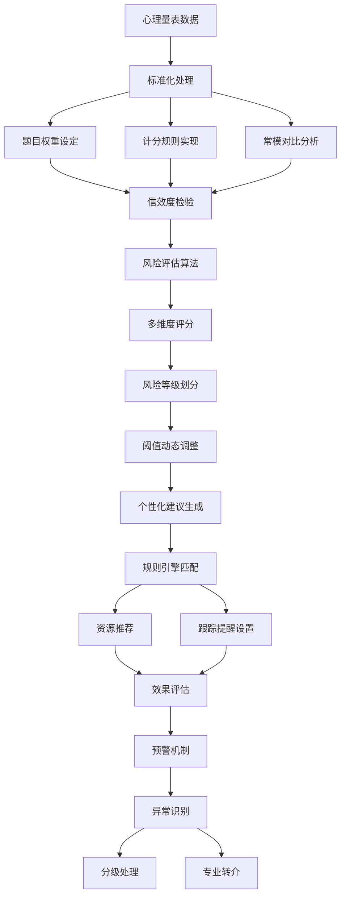
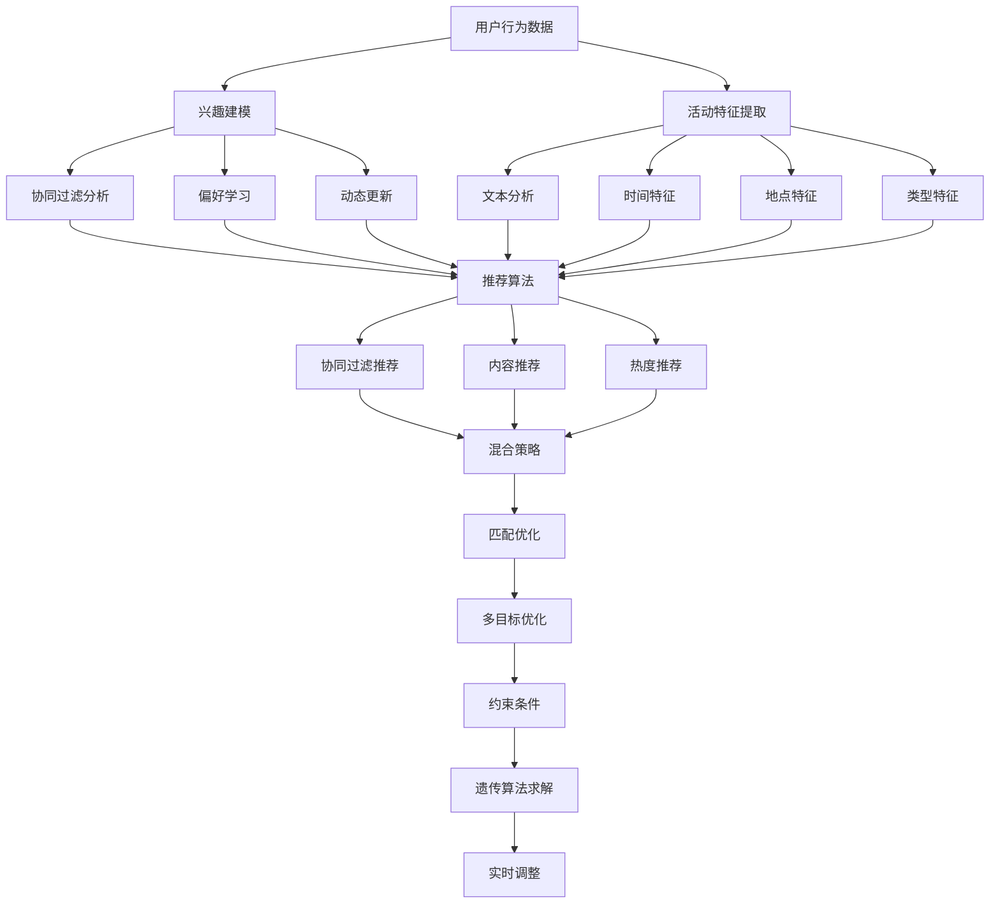
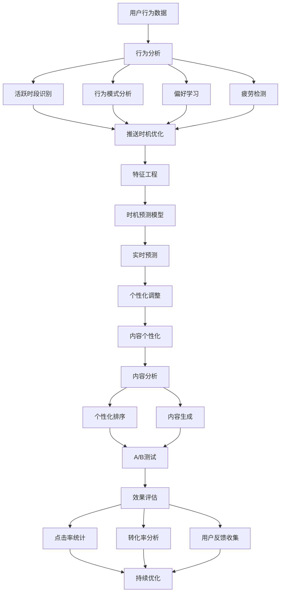

# 6.1 算法流程图

## 6.1.1 智能预约与资源调度算法

## 6.1.2 跑腿任务匹配与路径优化算法

## 6.1.3 智能推荐与个性化算法

## 6.1.4 积分与诚信度管理算法

## 6.1.5 异常检测与预警算法

## 6.1.6 食堂高峰预测与调度算法

## 6.1.7 共享设备排队与调度算法

## 6.1.8 心理测评与风险评估算法

## 6.1.9 活动推荐与匹配算法

## 6.1.10 消息推送与通知算法

