# 第7章 算法实现流程图

## 7.1 智能预约与资源调度算法实现

### 7.1.1 基于时间序列的资源需求预测算法

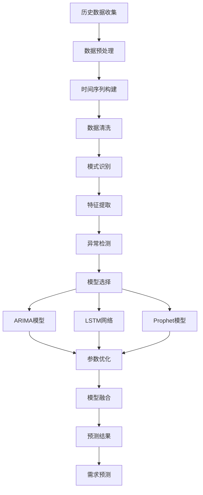

### 7.1.2 基于约束优化的资源分配算法

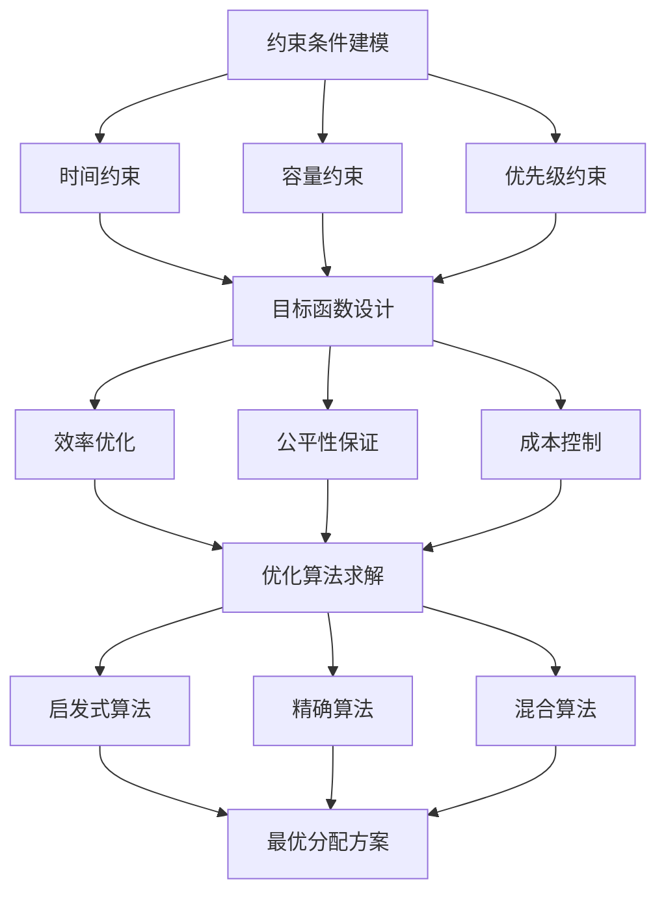

## 7.2 智能调度与优化算法实现

### 7.2.1 资源调度优化算法

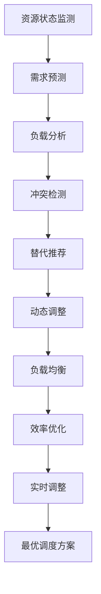

### 7.2.2 任务匹配与路径优化算法

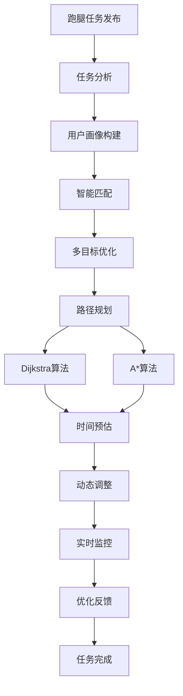

## 7.3 AI助手智能问答算法实现

### 7.3.1 基于CoreAgent的智能对话算法

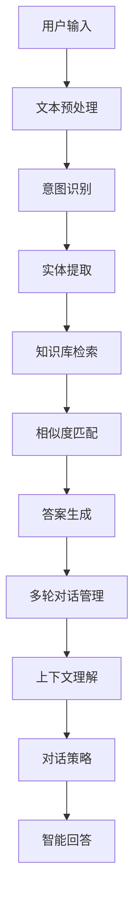

### 7.3.2 智能学习建议与资源推荐算法

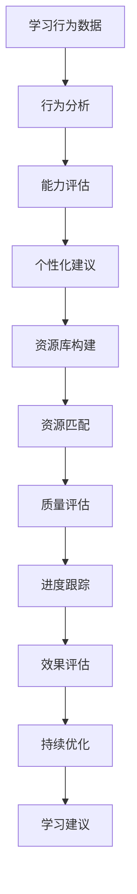

## 7.4 积分与诚信度管理算法实现

### 7.4.1 积分获取与计算算法

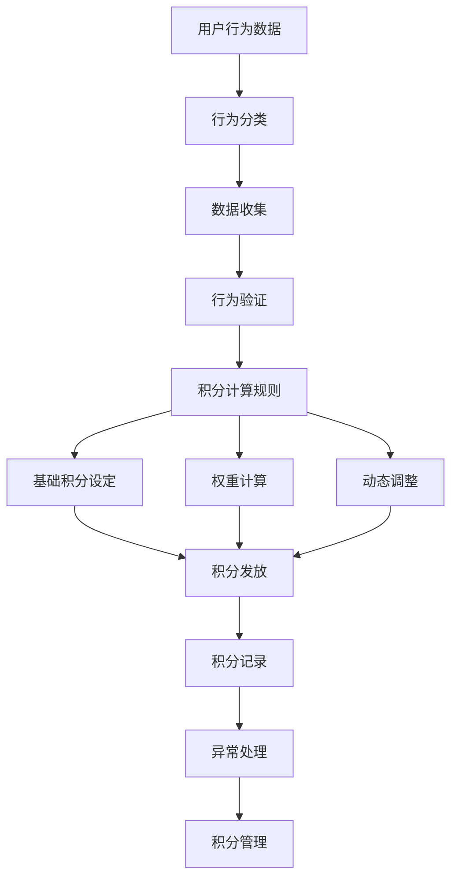

### 7.4.2 诚信度评估与更新算法

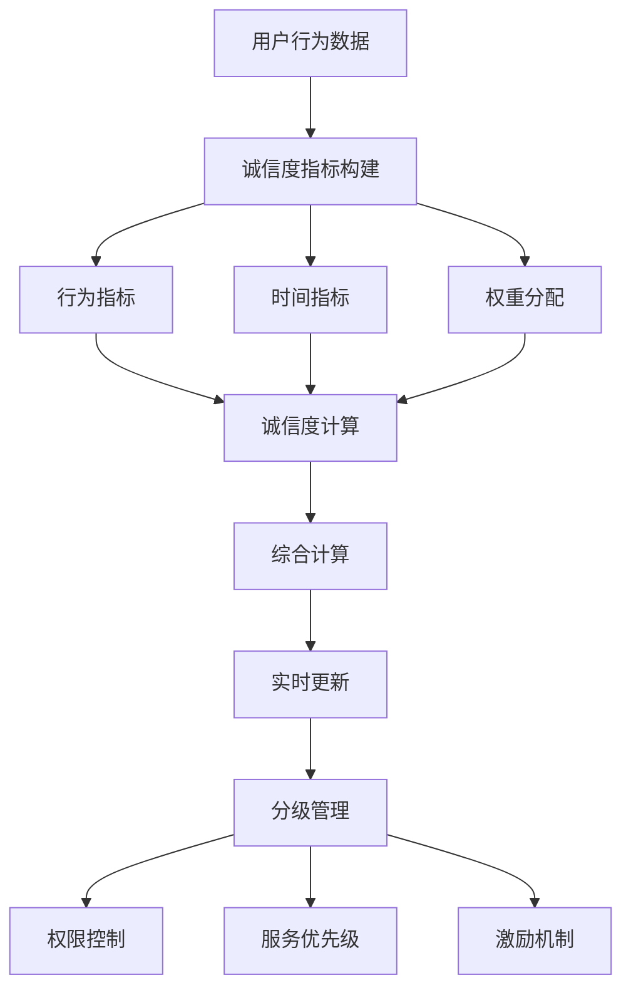

### 7.4.3 积分兑换与诚信度奖惩算法

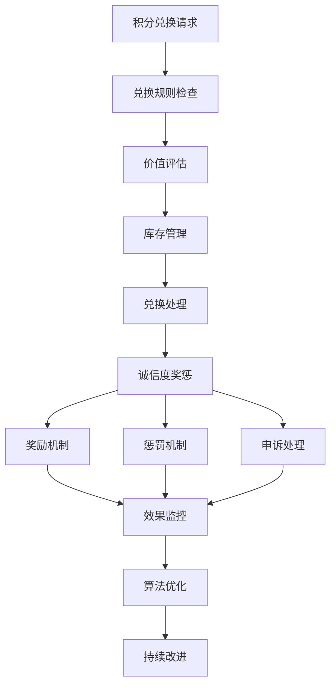

## 7.5 系统功能算法综合应用

### 7.5.1 校园生活服务算法应用

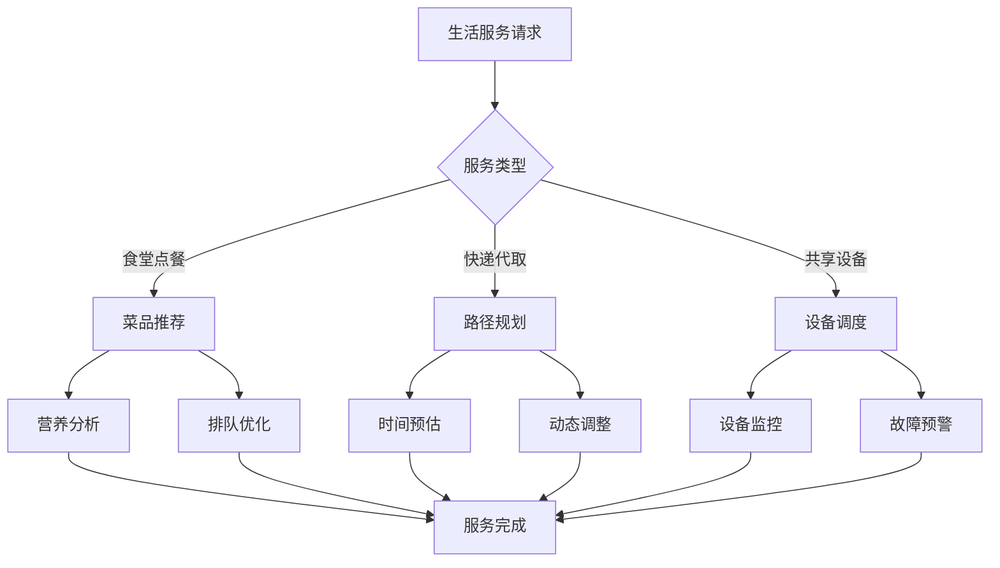

### 7.5.2 社交与内容管理算法应用

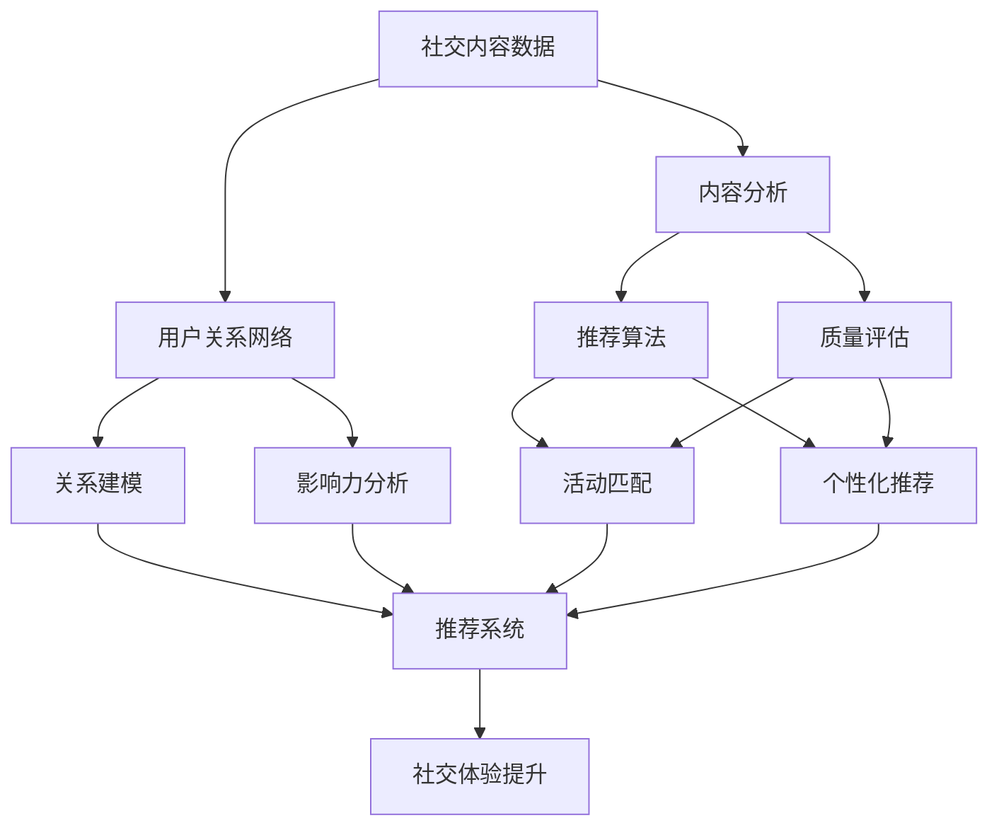

### 7.5.3 学习与心理健康算法应用

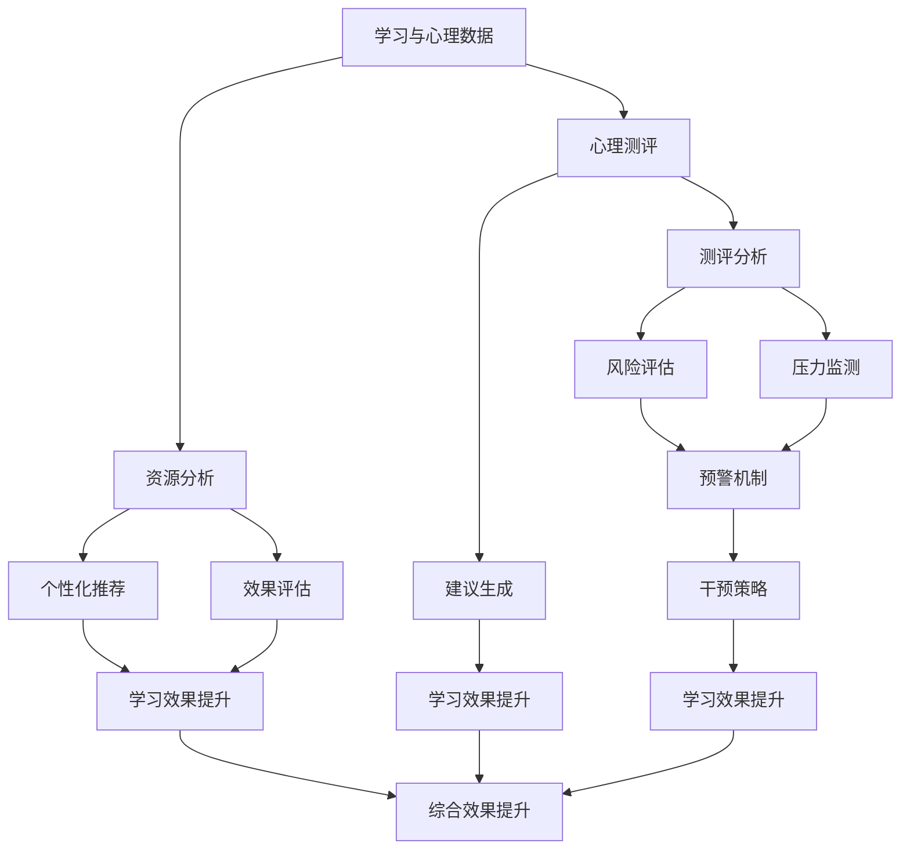

## 7.6 算法性能优化与监控

### 7.6.1 算法性能监控

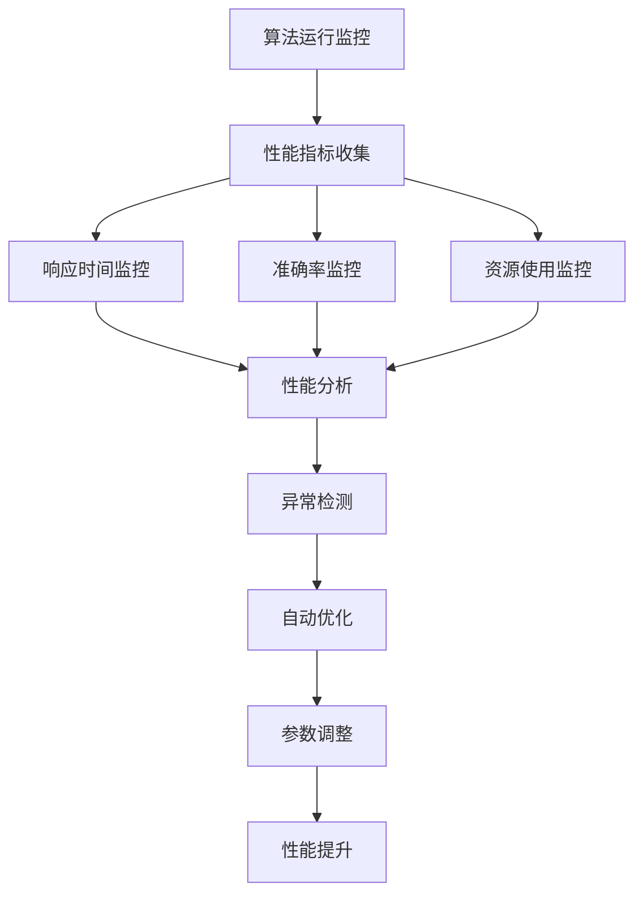

### 7.6.2 算法效果评估

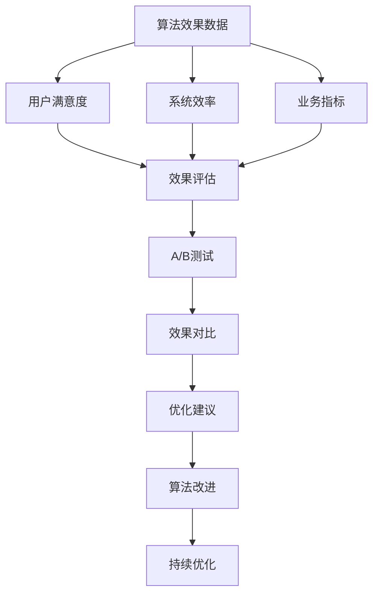
